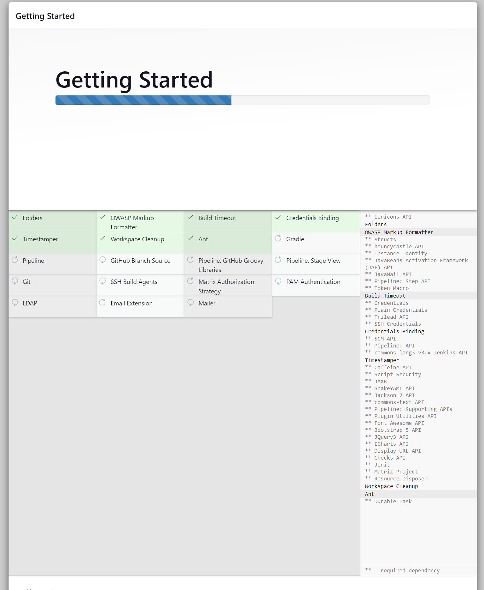
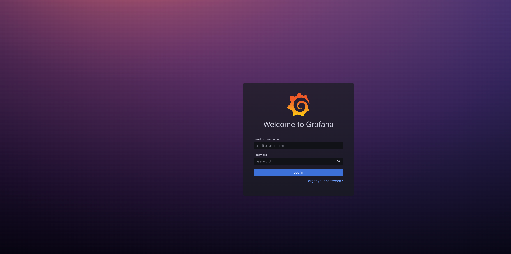
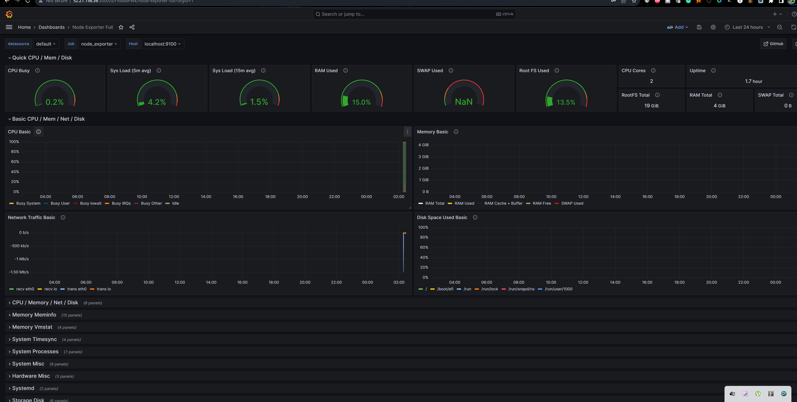

<div align="center">
  

  <br>
  <a href="http://netflix-clone-with-tmdb-using-react-mui.vercel.app/">
    
  </a>
</div>

<br />

<div align="center">
  
  <p align="center">Home Page</p>
</div>

## Deploy Netflix Clone on Cloud using Jenkins - DevSecOps Project!

**Description:**
This GitHub project showcases the seamless deployment of a Netflix Clone application on the cloud using Jenkins and a powerful stack of tools. We leverage Jenkins for continuous integration and continuous deployment (CI/CD) while harnessing the capabilities of Docker, Kubernetes, EC2, SonarQube, Prometheus, Grafana, Node Exporter, ArgoCD, EKS, and IAM to build a robust, scalable, and highly available infrastructure.

**Key Tools Utilized:**
- **Jenkins:** Automation and CI/CD pipeline orchestration.
- **Docker:** Containerization for efficient deployment.
- **Kubernetes:** Container orchestration and scaling.
- **EC2:** Elastic Compute Cloud for scalable virtual servers.
- **SonarQube:** Code quality and security analysis.
- **Prometheus and Grafana:** Monitoring and observability.
- **Node Exporter:** Collecting system metrics.
- **ArgoCD:** GitOps-based application delivery.
- **EKS:** Elastic Kubernetes Service for Kubernetes management.
- **IAM:** Identity and Access Management for security.

## Jenkins CI/CD Pipeline ##

- It took 15 builds builds troubleshooting before receiving a successful deployment.

- Correct login for Docker allowed for a successful build.


# Project Walkthrough #
## Phase 1: Initial Setup and Deployment ##

**Step 1: Launch EC2 (Ubuntu 22.04)**

In the initial phase, we set up and deploy our environment. The first step involves creating a virtual server (EC2 instance) on Amazon Web Services (AWS) with the Ubuntu 22.04 operating system. Once the instance is created, you can establish a connection to it using SSH for further configuration and deployment.

**Step 2: Clone the Code**

Update all the necessary packages and then proceed to clone your application's code repository onto the EC2 instance. This step involves fetching the code and making it accessible on the instance for further development and deployment.

```js git clone https://github.com/ryanbynoe/aws-netflix-clone-kubernetes ```


## Step 3: Install Docker and Run the App Using a Container

In this step, we'll set up Docker on the EC2 instance. Docker is a platform for developing, shipping, and running applications inside containers. It allows us to package applications and their dependencies into containers for efficient deployment.

The process includes:
- Installing Docker on the EC2 instance:

```js 
sudo apt-get update
sudo apt-get install docker.io -y
sudo usermod -aG docker $USER  # Replace with your system's username, e.g., 'ubuntu'
newgrp docker
sudo chmod 777 /var/run/docker.sock
```

- Configuring Docker to work correctly. 
```js docker build -t netflix .
docker run -d --name netflix -p 8081:80 netflix:latest

#to delete
docker stop <containerid>
docker rmi -f netflix 
```
- Building and running your application within a Docker container. This containerization approach ensures that your application is isolated and runs consistently, regardless of the environment, making it easier to manage and deploy.

**Step 4: Get the API Key**

To proceed, you'll need to acquire an API key for your application from TMDB (The Movie Database). Follow these steps to obtain the necessary API key:

1. Open a web browser and navigate to the TMDB website.
2. Click on the "Login" option to create an account if you haven't already.
3. After logging in, go to your user profile and select "Settings."
4. In the "Settings" menu, click on "API" located on the left-side panel.
5. Create a new API key by clicking the "Create" button and accepting the terms and conditions.
6. Provide the required basic details, and then click "Submit."

Once you complete these steps, you will receive your TMDB API key.

With the API key in hand, you can now recreate the Docker image, ensuring that your application is configured to utilize this key for specific functionalities.

```js 
docker build --build-arg TMDB_V3_API_KEY=<your-api-key> -t netflix .
```

# Phase 2: Security

## Install SonarQube and Trivy

In this phase, the focus is on enhancing security. The first part involves the installation of two important security tools, SonarQube and Trivy, on your EC2 instance. These tools are used to scan for vulnerabilities and ensure the security of your applications.

**Step 1: Install SonarQube**
```js
docker run -d --name sonar -p 9000:9000 sonarqube:lts-community
```

To access:

publicIP:9000 (by default username & password is admin)

To install Trivy:

```js
sudo apt-get install wget apt-transport-https gnupg lsb-release
wget -qO - https://aquasecurity.github.io/trivy-repo/deb/public.key | sudo apt-key add -
echo deb https://aquasecurity.github.io/trivy-repo/deb $(lsb_release -sc) main | sudo tee -a /etc/apt/sources.list.d/trivy.list
sudo apt-get update
sudo apt-get install trivy        
```

Scan Image by using Trivy:
```js
trivy image <imageid>
```
**Step 3: Integrate SonarQube and Configure**

In this step, you'll integrate SonarQube with your CI/CD (Continuous Integration/Continuous Deployment) pipeline. This integration allows you to incorporate code quality and security checks into your automated development process.

The key tasks in this step include:

1. Integrating SonarQube into your CI/CD pipeline to trigger code analysis as part of the deployment process.
2. Configuring SonarQube to analyze your code for both quality and security issues. This configuration will ensure that code is thoroughly assessed for vulnerabilities and adherence to coding standards.

By performing these tasks, you'll be able to maintain a high level of code quality and security throughout your development and deployment workflows.

# Phase 3: CI/CD Setup

## Install Jenkins for Automation

In this phase, we're setting up a Continuous Integration/Continuous Deployment (CI/CD) system to automate the deployment of our applications. The first step is to install Jenkins on the EC2 instance, which will serve as our automation platform. To do this, we'll start by installing Java as a prerequisite.

**Step 1: Install Java**
```js
sudo apt update
sudo apt install fontconfig openjdk-17-jre
java -version
openjdk version "17.0.8" 2023-07-18
OpenJDK Runtime Environment (build 17.0.8+7-Debian-1deb12u1)
OpenJDK 64-Bit Server VM (build 17.0.8+7-Debian-1deb12u1, mixed mode, sharing)

#jenkins
sudo wget -O /usr/share/keyrings/jenkins-keyring.asc \
https://pkg.jenkins.io/debian-stable/jenkins.io-2023.key
echo deb [signed-by=/usr/share/keyrings/jenkins-keyring.asc] \
https://pkg.jenkins.io/debian-stable binary/ | sudo tee \
/etc/apt/sources.list.d/jenkins.list > /dev/null
sudo apt-get update
sudo apt-get install jenkins
sudo systemctl start jenkins
sudo systemctl enable jenkins
```

**Access Jenkins in a Web Browser**

After successfully installing Jenkins, you can access it through a web browser using the public IP address of your EC2 instance. The default port for accessing Jenkins is port 8080.

To access Jenkins, open your web browser and enter the following URL:

publicIp:8080


This will allow you to log in to the Jenkins web interface and start configuring your automation workflows.

Here is an example of my Jenkins page and getting started:


**Install Necessary Plugins in Jenkins**

To enhance the functionality of Jenkins for your CI/CD workflows, you'll need to install specific plugins. Follow these steps to install the required plugins:

1. Go to the "Manage Jenkins" section within the Jenkins interface.
2. From there, navigate to "Plugins" and select "Available Plugins."
3. In the "Available Plugins" section, locate and install the following plugins:

   - Eclipse Temurin Installer (Install without restart)
   - SonarQube Scanner (Install without restart)
   - NodeJs Plugin (Install Without restart)
   - Email Extension Plugin

By installing these plugins, you'll be able to extend Jenkins with additional capabilities, ensuring a more robust automation environment.

**Configure Java and Node.js in Global Tool Configuration**

To ensure that Jenkins has the appropriate versions of Java and Node.js installed for your CI/CD pipelines, follow these steps to configure them in the Global Tool Configuration:

1. Go to the "Manage Jenkins" section within the Jenkins interface.
2. Select "Tools" and navigate to "Install JDK(17) and NodeJs(16)."
3. Once you've selected the desired versions of Java (JDK 17) and Node.js (NodeJs 16), click on "Apply" and then

**Step 5: SonarQube - Create the Token**

To integrate SonarQube with Jenkins, you'll need to create a token for authentication. Follow these steps to create the token:

1. Go to the Jenkins Dashboard.
2. Navigate to "Manage Jenkins" and select "Credentials."
3. Choose "Add Secret Text" and provide the necessary information as specified.

After adding the Sonar token, make sure to click on "Apply" and "Save" to save your configuration.

**Important Notes:**
- The "Configure System" option in Jenkins is used to configure different server settings.
- The "Global Tool Configuration" is used to configure various tools that are installed using Jenkins plugins. In this case, you'll install a Sonar Scanner as one of the tools.

Additionally, you may consider creating a Jenkins webhook for specific purposes.

By following these steps, you'll establish the necessary integration and configurations to enhance your Jenkins CI/CD pipelines.

**Configure CI/CD Pipeline in Jenkins:**
- Create a CI/CD pipeline in Jenkins to automate your application deployment.

```js
pipeline {
    agent any
    tools {
        jdk 'jdk17'
        nodejs 'node16'
    }
    environment {
        SCANNER_HOME = tool 'sonar-scanner'
    }
    stages {
        stage('clean workspace') {
            steps {
                cleanWs()
            }
        }
        stage('Checkout from Git') {
            steps {
                git branch: 'main', url: 'https://github.com/ryanbynoe/aws-netflix-clone-kubernetes'
            }
        }
        stage("Sonarqube Analysis") {
            steps {
                withSonarQubeEnv('sonar-server') {
                    sh '''$SCANNER_HOME/bin/sonar-scanner -Dsonar.projectName=Netflix \
                    -Dsonar.projectKey=Netflix'''
                }
            }
        }
        stage("quality gate") {
            steps {
                script {
                    waitForQualityGate abortPipeline: false, credentialsId: 'Sonar-token'
                }
            }
        }
        stage('Install Dependencies') {
            steps {
                sh "npm install"
            }
        }
    }
}
```

**Install Dependency-Check and Docker Tools in Jenkins**

In this step, you'll enhance Jenkins with the necessary tools to manage dependencies and work with Docker containers. First, we'll install the Dependency-Check plugin:

1. Start by accessing your Jenkins dashboard.

2. Navigate to "Manage Jenkins" and select "Manage Plugins."

3. In the "Manage Plugins" section, click on the "Available" tab.

4. Use the search feature to find the "OWASP Dependency-Check" plugin.

5. Check the checkbox for "OWASP Dependency-Check."

6. Click on the "Install without restart" button.

This installation process equips Jenkins with the capability to perform dependency checks for your projects.

**Configure Dependency-Check Tool**

After successfully installing the Dependency-Check plugin, it's essential to configure the tool for your Jenkins environment. Here's how you can do it:

1. Go to your Jenkins dashboard.

2. Navigate to "Manage Jenkins" and then select "Global Tool Configuration."

3. Locate the section dedicated to "OWASP Dependency-Check."

4. Add a name for the tool; for example, you can use "DP-Check."

5. Save your settings.

By configuring the Dependency-Check tool, you ensure that Jenkins is properly set up to perform dependency checks as part of your CI/CD pipelines.

**Install Docker Tools and Docker Plugins**

To facilitate Docker-related tasks in Jenkins, including building and working with Docker containers, you'll need to install Docker tools and plugins. Follow these steps:

1. Begin by accessing your Jenkins dashboard.

2. Navigate to "Manage Jenkins" and select "Manage Plugins."

3. In the "Manage Plugins" section, go to the "Available" tab.

4. Utilize the search feature to find plugins related to "Docker."

5. Check the following Docker-related plugins:
   - Docker
   - Docker Commons
   - Docker Pipeline
   - Docker API
   - docker-build-step

6. Once you've selected these plugins, click on the "Install without restart" button to initiate the installation process.

By installing these Docker-related tools and plugins, you equip Jenkins with the capabilities necessary for working with Docker containers within your CI/CD pipelines.

**Add DockerHub Credentials**

To ensure the secure handling of your DockerHub credentials within your Jenkins pipeline, follow these steps:

1. Go to your Jenkins dashboard.

2. Navigate to "Manage Jenkins" and select "Manage Credentials."

3. Click on "System" and then access "Global credentials (unrestricted)."

4. On the left side, click on "Add Credentials."

5. Choose "Secret text" as the type of credentials to create.

6. Provide your DockerHub credentials, including your DockerHub username and password.

7. Assign an ID to these credentials (e.g., "docker").

8. Click "OK" to save and store your DockerHub credentials securely within Jenkins.

By adding these DockerHub credentials, you ensure that Jenkins can access your DockerHub account in a secure and controlled manner for your Docker-related tasks in your CI/CD pipelines.

**Configure Jenkins Pipeline with Installed Tools and Credentials**

Having successfully installed the Dependency-Check plugin, configured the tool, and added the necessary Docker-related plugins and DockerHub credentials in Jenkins, you are now ready to configure your Jenkins pipeline. This configuration will incorporate these tools and credentials into your CI/CD process, ensuring that your continuous integration and continuous deployment workflows are streamlined and secure.

If you have more instructions or steps to rephrase, please provide them, and I'll continue to format them accordingly.

# Phase 4: Monitoring

In this phase, you will set up monitoring for your applications using Prometheus and Grafana. The first step is to install Prometheus:

**Installing Prometheus**

To install Prometheus and begin monitoring your applications, follow these steps:

1. Start by creating a dedicated Linux user for Prometheus.

2. Download Prometheus from the official source.

These steps lay the foundation for setting up a robust monitoring system for your applications.

```js
sudo useradd --system --no-create-home --shell /bin/false prometheus
wget https://github.com/prometheus/prometheus/releases/download/v2.47.1/prometheus-2.47.1.linux-amd64.tar.gz
```
Extract Prometheus files, move them, and create directories:

```js
tar -xvf prometheus-2.47.1.linux-amd64.tar.gz
cd prometheus-2.47.1.linux-amd64/
sudo mkdir -p /data /etc/prometheus
sudo mv prometheus promtool /usr/local/bin/
sudo mv consoles/ console_libraries/ /etc/prometheus/
sudo mv prometheus.yml /etc/prometheus/prometheus.yml
```
Set ownership for directories:
```js
sudo chown -R prometheus:prometheus /etc/prometheus/ /data/
```

Create a systemd unit configuration file for Prometheus:

```js 
sudo nano /etc/systemd/system/prometheus.service
```
Add the following content to the ```prometheus.service``` file:

```js
[Unit]
Description=Prometheus
Wants=network-online.target
After=network-online.target

StartLimitIntervalSec=500
StartLimitBurst=5

[Service]
User=prometheus
Group=prometheus
Type=simple
Restart=on-failure
RestartSec=5s
ExecStart=/usr/local/bin/prometheus \
  --config.file=/etc/prometheus/prometheus.yml \
  --storage.tsdb.path=/data \
  --web.console.templates=/etc/prometheus/consoles \
  --web.console.libraries=/etc/prometheus/console_libraries \
  --web.listen-address=0.0.0.0:9090 \
  --web.enable-lifecycle

[Install]
WantedBy=multi-user.target
```
**Prometheus Service Configuration Explained**

In the `prometheus.service` file, there are several key components that play a crucial role in running Prometheus as a service. Here's a brief explanation of these parts:

- `User` and `Group`: These settings specify the Linux user and group under which Prometheus will execute. It is essential to run Prometheus with the appropriate permissions for security and stability.

- `ExecStart`: This section defines the behavior of Prometheus when it's started as a service. It includes:
  - The path to the Prometheus binary.
  - The location of the configuration file (`prometheus.yml`).
  - The directory where Prometheus will store its time-series data.
  - Other configuration settings necessary for Prometheus to operate correctly.

- `web.listen-address`: This setting configures Prometheus to listen on all network interfaces, allowing it to accept incoming requests on port 9090. This is where Prometheus's web interface and API can be accessed.

- `web.enable-lifecycle`: Enabling this setting allows for the management of Prometheus through API calls, providing greater flexibility and control in managing the Prometheus service.

These configurations are essential for running Prometheus as a service and ensuring it operates smoothly, collecting and serving monitoring data.

Enable and start Prometheus:

```js
sudo systemctl enable prometheus
sudo systemctl start prometheus
```
Verify Prometheus's status:
```js
sudo systemctl status prometheus
```
You can access Prometheus in a web browser using your server's IP and port 9090:

```http://<your-server-ip>:9090```

Installing Node Exporter:

Create a system user for Node Exporter and download Node Exporter:

```js
sudo useradd --system --no-create-home --shell /bin/false node_exporter
wget https://github.com/prometheus/node_exporter/releases/download/v1.6.1/node_exporter-1.6.1.linux-amd64.tar.gz
```
Extract Node Exporter files, move the binary, and clean up:

```js
tar -xvf node_exporter-1.6.1.linux-amd64.tar.gz
sudo mv node_exporter-1.6.1.linux-amd64/node_exporter /usr/local/bin/
rm -rf node_exporter*
```

Create a systemd unit configuration file for Node Exporter:

```js 
sudo nano /etc/systemd/system/node_exporter.service
```

Add the following content to the ```node_exporter.service``` file:
```js
[Unit]
Description=Node Exporter
Wants=network-online.target
After=network-online.target

StartLimitIntervalSec=500
StartLimitBurst=5

[Service]
User=node_exporter
Group=node_exporter
Type=simple
Restart=on-failure
RestartSec=5s
ExecStart=/usr/local/bin/node_exporter --collector.logind

[Install]
WantedBy=multi-user.target
```
Replace --collector.logind with any additional flags as needed.

Enable and start Node Exporter:

```js 
sudo systemctl enable node_exporter
sudo systemctl start node_exporter
```
Verify the Node Exporter's status:

```js
sudo systemctl status node_exporter
 ```
You can access Node Exporter metrics in Prometheus.

**Configure Prometheus Plugin Integration**

To effectively monitor your CI/CD pipeline in Jenkins, you will integrate it with Prometheus. This involves configuring Prometheus to scrape metrics from both Node Exporter and Jenkins. Here's how to do it:

1. **Prometheus Configuration**: Modify the `prometheus.yml` file to specify how Prometheus will collect and monitor metrics. Below is an example configuration to get you started.

```yaml
global:
  scrape_interval: 15s

scrape_configs:
  - job_name: 'node_exporter'
    static_configs:
      - targets: ['localhost:9100']

  - job_name: 'jenkins'
    metrics_path: '/prometheus'
    static_configs:
      - targets: ['<your-jenkins-ip>:<your-jenkins-port>']
```

Make sure to replace ```<your-jenkins-ip>``` and ```<your-jenkins-port>``` with the appropriate values for your Jenkins setup.

By implementing this configuration, Prometheus will collect data from these sources, enabling you to monitor your CI/CD pipeline effectively.

Check the validity of the configuration file:

```js
promtool check config /etc/prometheus/prometheus.yml
```

Reload the Prometheus configuration without restarting:
```js
curl -X POST http://localhost:9090/-/reload
```

Prometheus targets:
http://```<your-prometheus-ip>```:9090/targets

**Install Grafana on Ubuntu 22.04 and Set it up to Work with Prometheus**

To effectively monitor your system, you'll need to install Grafana and configure it to work with Prometheus. Here's how to do it:

1. **Install Dependencies**: Before setting up Grafana, make sure you have all the necessary dependencies. Run the following commands to ensure they are installed:

```bash
sudo apt-get update
sudo apt-get install -y apt-transport-https software-properties-common
```

Step 2: Add the GPG Key:

Add the GPG key for Grafana:

```js
wget -q -O - https://packages.grafana.com/gpg.key | sudo apt-key add -
```

Step 3: Add Grafana Repository:

Add the repository for Grafana stable releases:
```js
echo "deb https://packages.grafana.com/oss/deb stable main" | sudo tee -a /etc/apt/sources.list.d/grafana.list
```
Step 4: Update and Install Grafana:

Update the package list and install Grafana:
```js
sudo apt-get update
sudo apt-get -y install grafana
```
Step 5: Enable and Start Grafana Service:

To automatically start Grafana after a reboot, enable the service:
```js
sudo systemctl enable grafana-server
```
start Grafana:
```js
sudo systemctl start grafana-server
```

Step 6: Check Grafana Status:

Verify the status of the Grafana service to ensure it's running correctly:

```js
sudo systemctl status grafana-server
```
**Step 16: Access Grafana Web Interface**

After verifying the status of the Grafana service, you can access the Grafana web interface to start using it for monitoring and visualization. Here's how to access it:

1. Open your web browser.

2. In the address bar, enter your server's IP address followed by the default port for Grafana, which is 3000. For example:

```http://<your-server-ip>:3000```


Replace `<your-server-ip>` with the actual IP address of your server. This will take you to the Grafana login page.

3. You'll be prompted to log in to Grafana. The default username is "admin," and the default password is also "admin."

After successfully logging in, you can start configuring Grafana and creating dashboards for monitoring your system.

Grafana Homepage should look like:



**Change the Default Password in Grafana**

For security reasons, it's essential to change the default password after your initial login to Grafana. Follow these steps to update your password:

1. After logging in with the default credentials (username: "admin" and password: "admin"), Grafana will prompt you to change your password.

2. Follow the prompts provided in the Grafana interface to set a new, secure password. Be sure to choose a password that meets your organization's security requirements.

3. After successfully changing your password, you'll have enhanced security for accessing Grafana and its monitoring capabilities.

Now, with your updated password, you can confidently use Grafana for monitoring and visualization tasks.

**Add Prometheus Data Source in Grafana**

To visualize metrics in Grafana, you need to add a data source. Follow these steps to configure Prometheus as a data source:

1. In the Grafana interface, look for the gear icon (⚙️) in the left sidebar, and click on it to open the "Configuration" menu.

2. From the "Configuration" menu, select "Data Sources."

3. Click on the "Add data source" button to initiate the data source setup.

4. Choose "Prometheus" as the data source type from the available options.

5. In the "HTTP" section, you will need to provide the URL for your Prometheus server. Assuming Prometheus is running on the same server, set the "URL" to:

```http://localhost:9090```


6. After configuring the URL, click the "Save & Test" button. Grafana will attempt to establish a connection to the Prometheus data source to ensure it's working correctly.

This step allows Grafana to communicate with Prometheus, making it possible to create dashboards and visualize the metrics collected by Prometheus.

**Import a Dashboard in Grafana**

To facilitate the viewing of metrics, you can import a pre-configured dashboard. Follow these steps:

1. In the Grafana interface, look for the "+" (plus) icon in the left sidebar and click on it to open the "Create" menu.

2. Select "Dashboard" from the options available.

3. Click on the "Import" dashboard option to start the import process.

4. You will be prompted to enter the dashboard code you wish to import. For example, you can use code 1860 for a specific dashboard.

5. After entering the code, click the "Load" button to initiate the import.

6. You'll need to select the data source you added (Prometheus) from the dropdown list.

7. Finally, click on the "Import" button to complete the process. Grafana will import the selected dashboard, allowing you to visualize metrics from Prometheus.

Grafana is a versatile tool for creating visualizations and dashboards, and you have the flexibility to further customize it to align with your specific monitoring requirements.

With this step, you've successfully installed and configured Grafana to work seamlessly with Prometheus for monitoring and visualizing metrics.

Here is what my graph looks like:



Configure Prometheus Plugin Integration:
Integrate Jenkins with Prometheus to monitor the CI/CD pipeline.

**Phase 5: Notification**

Implement Notification Services:
Set up email notifications in Jenkins or other notification mechanisms.

# Phase 6: Kubernetes

**Kubernetes Setup**

In this phase, you'll create a Kubernetes cluster with node groups to provide a scalable environment for deploying and managing your applications. Here's how to proceed:

## Monitor Kubernetes with Prometheus##
Prometheus is a powerful monitoring and alerting toolkit, and you'll use it to monitor your Kubernetes cluster. Additionally, you'll install the node exporter using Helm to collect metrics from your cluster nodes.

**Install Node Exporter using Helm**
To begin monitoring your Kubernetes cluster, you'll install the Prometheus Node Exporter. This component allows you to collect system-level metrics from your cluster nodes. Here are the steps to install the Node Exporter using Helm:

Add the Prometheus Community Helm repository:

```js
helm repo add prometheus-community https://prometheus-community.github.io/helm-charts
```
Create a Kubernetes namespace for the Node Exporter:

```js
kubectl create namespace prometheus-node-exporter
```
Install the Node Exporter using Helm:

```js
helm install prometheus-node-exporter prometheus-community/prometheus-node-exporter --namespace prometheus-node-exporter
```

Replace 'your-job-name' with a descriptive name for your job, and 'nodeip:9001' with the IP address or hostname and port of the endpoint you want to scrape metrics from.

Save the changes to your prometheus.yml file.

After making this update, Prometheus will start scraping metrics from the specified endpoint using the job you configured.

Ensure that your Prometheus server is properly configured to reload its configuration after changes. This can typically be done by sending a SIGHUP signal to the Prometheus process.

This step allows Prometheus to collect metrics from the specified endpoint and include them in your monitoring setup.

Remember to replace ``your-job-name`` and ```nodeip:9001``` with your specific job name and endpoint details.

```js
  - job_name: 'Netflix'
    metrics_path: '/metrics'
    static_configs:
      - targets: ['node1Ip:9100']
```
# Deploy Application with ArgoCD

Install ArgoCD:

You can install ArgoCD on your Kubernetes cluster by following the instructions provided in the EKS Workshop documentation.

Set Your GitHub Repository as a Source:

After installing ArgoCD, you need to set up your GitHub repository as a source for your application deployment. This typically involves configuring the connection to your repository and defining the source for your ArgoCD application. The specific steps will depend on your setup and requirements.

3. **Create an ArgoCD Application:**
   - `name`: Set the name for your application.
   - `destination`: Define the destination where your application should be deployed.
   - `project`: Specify the project the application belongs to.
   - `source`: Set the source of your application, including the GitHub repository URL, revision, and the path to the application within the repository.
   - `syncPolicy`: Configure the sync policy, including automatic syncing, pruning, and self-healing.

4. **Access your Application**
   - To Access the app make sure port 30007 is open in your security group and then open a new tab paste your NodeIP:30007, your app should be running.

**Phase 7: Cleanup**

1. **Cleanup AWS EC2 Instances:**
    - Terminate AWS EC2 instances that are no longer needed.


