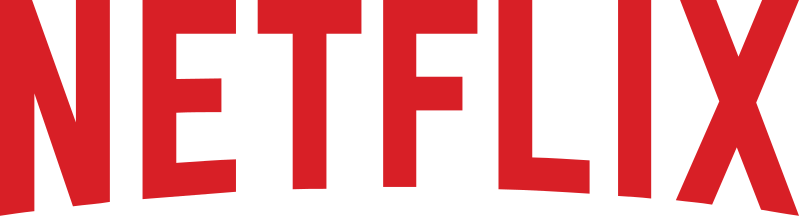

<div align="center">
  

  <br>
  <a href="http://netflix-clone-with-tmdb-using-react-mui.vercel.app/">
    
  </a>
</div>

<br />

<div align="center">
  
  <p align="center">Home Page</p>
</div>

## Deploy Netflix Clone on Cloud using Jenkins - DevSecOps Project!

**Description:**
This GitHub project showcases the seamless deployment of a Netflix Clone application on the cloud using Jenkins and a powerful stack of tools. We leverage Jenkins for continuous integration and continuous deployment (CI/CD) while harnessing the capabilities of Docker, Kubernetes, EC2, SonarQube, Prometheus, Grafana, Node Exporter, ArgoCD, EKS, and IAM to build a robust, scalable, and highly available infrastructure.

**Key Tools Utilized:**
- **Jenkins:** Automation and CI/CD pipeline orchestration.
- **Docker:** Containerization for efficient deployment.
- **Kubernetes:** Container orchestration and scaling.
- **EC2:** Elastic Compute Cloud for scalable virtual servers.
- **SonarQube:** Code quality and security analysis.
- **Prometheus and Grafana:** Monitoring and observability.
- **Node Exporter:** Collecting system metrics.
- **ArgoCD:** GitOps-based application delivery.
- **EKS:** Elastic Kubernetes Service for Kubernetes management.
- **IAM:** Identity and Access Management for security.

## Jenkins CI/CD Pipeline ##

- It took 15 builds builds troubleshooting before receiving a successful deployment.

- Correct login for Docker allowed for a successful build.


# Project Walkthrough #
## Phase 1: Initial Setup and Deployment ##

**Step 1: Launch EC2 (Ubuntu 22.04)**

In the initial phase, we set up and deploy our environment. The first step involves creating a virtual server (EC2 instance) on Amazon Web Services (AWS) with the Ubuntu 22.04 operating system. Once the instance is created, you can establish a connection to it using SSH for further configuration and deployment.

**Step 2: Clone the Code**

Update all the necessary packages and then proceed to clone your application's code repository onto the EC2 instance. This step involves fetching the code and making it accessible on the instance for further development and deployment.

```js git clone https://github.com/ryanbynoe/aws-netflix-clone-kubernetes ```

## Step 3: Install Docker and Run the App Using a Container

In this step, we'll set up Docker on the EC2 instance. Docker is a platform for developing, shipping, and running applications inside containers. It allows us to package applications and their dependencies into containers for efficient deployment.

The process includes:
- Installing Docker on the EC2 instance: ``` js 
sudo apt-get update
sudo apt-get install docker.io -y
sudo usermod -aG docker $USER  # Replace with your system's username, e.g., 'ubuntu'
newgrp docker
sudo chmod 777 /var/run/docker.sock```
- Configuring Docker to work correctly.
- Building and running your application within a Docker container. This containerization approach ensures that your application is isolated and runs consistently, regardless of the environment, making it easier to manage and deploy.

**Step 4: Get the API Key**

To proceed, you'll need to acquire an API key for your application from TMDB (The Movie Database). Follow these steps to obtain the necessary API key:

1. Open a web browser and navigate to the TMDB website.
2. Click on the "Login" option to create an account if you haven't already.
3. After logging in, go to your user profile and select "Settings."
4. In the "Settings" menu, click on "API" located on the left-side panel.
5. Create a new API key by clicking the "Create" button and accepting the terms and conditions.
6. Provide the required basic details, and then click "Submit."

Once you complete these steps, you will receive your TMDB API key.

With the API key in hand, you can now recreate the Docker image, ensuring that your application is configured to utilize this key for specific functionalities.

## Resources/Credits ##

Mr Cloudbook - https://mrcloudbook.hashnode.dev/devsecops-netflix-clone-ci-cd-with-monitoring-email

Nasiullha Chaudhari - https://github.com/N4si/DevSecOps-Project


